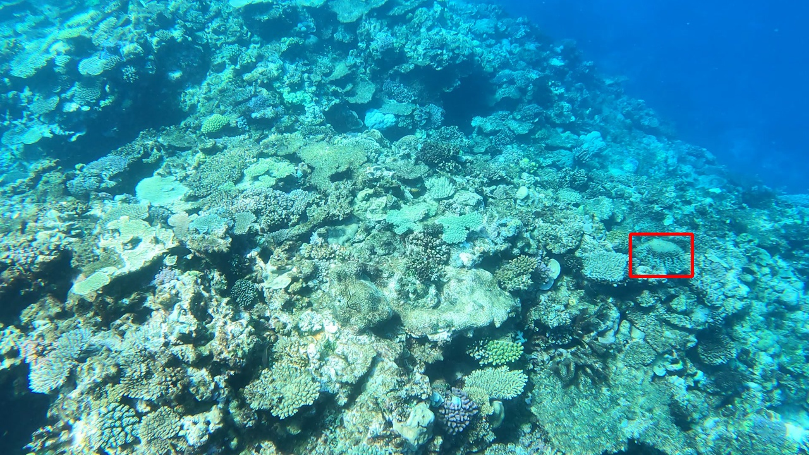
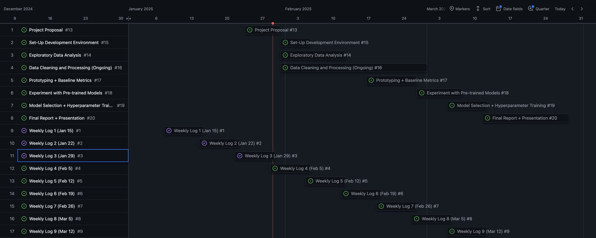

---
output:
  pdf_document: default
---

# The Great Barrier Reef: Crown-of-Thorns Starfish Detection

## Introduction

The Great Barrier Reef, off the coast of Queensland, Australia, is a vibrant underwater ecosystem home to thousands of species of marine life and one of the seven natural wonders of the world. In recent years, it has faced a major threat: overpopulation of crown-of-thorns starfish (COTS), which rapidly consume hard coral and devastate reef-building corals. Of the four known COTS species, the Pacific variety (*Acanthaster cf. solaris*) is the primary culprit behind recurring outbreaks.

Traditionally, COTS detection relies on a reef survey method called the "Manta Tow" method, where a snorkeler towed by a boat stops every 200 meters to visually assess the reef—a cumbersome and potentially error-prone process that is difficult to operationally scale. This project aims to enhance COTS detection in the Great Barrier Reef by leveraging machine learning and analyzing thousands of underwater images to identify the species more efficiently. Improving detection will aid intervention efforts, helping to control outbreaks and protect the Reef.

## Data Description

The image data is derived from three underwater videos taken at various times and locations around the Great Barrier Reef. Each video has been converted into a sequence of frames (i.e., $\approx 23$K images).

| video_id | sequence | video_frame | sequence_frame | image_id | annotations |
|------|------|---------|------------|-------|-----------------------------------|
| 0 | 40258 | 15 | 15 | 0-15 | [] |
| 0 | 45518 | 1010 | 137 | 0-1010 | [{'x':997, 'y':370, 'width':98, 'height':67}] |

: Selected Rows from Data

Table 1 outlines the CSV file format for labelled image data. For each `video_id`, a `sequence` represents a continuous sequence of footage, resetting when the footage is interrupted. The `video_frame` and `sequence_frame` correspond to the index of the image with respect to the entire video and the sequence, respectively. The `image_id` is the unique identifier that corresponds to a unique image. If a COTS is present, a bounding box is defined in the `annotations` column using pixel coordinates, where *(x, y)* marks the upper-left corner, and *width* and *height* specify the box dimensions. A single image may contain multiple bounding boxes if multiple COTS are present.

{width="3in"}

As illustrated in Figure 1 (based on the second row of Table 1), a red bounding box highlights a detected COTS. Note that the raw images are not annotated by default and bounding boxes must be dynamically incorporated during model training.

## Proposed Solution & Tools

Since this is a computer vision task, a Convolutional Neural Network (CNN) is a logical starting point due to its ability to layer filters that discern patterns in images like edges and structures. However, CNNs are better suited for single-object classification (e.g., presence/absence, binary or multi-class tasks). This project aims to identify zero to multiple COTS in a single image, so object detection algorithms (e.g., YOLO) are expected to perform better and may be the preferred first step.

The project workflow will utilize several tools and frameworks outlined below:

**Development Environment:** Code will be written in Python using Jupyter Notebooks for interactive and reproducible analyses and a Python IDE (e.g., VSCode) for model development.

-   *Scikit-learn* – Data processing, cleaning, and model performance metrics.

-   *TensorFlow/Keras* – Building deep learning architectures, including CNNs. Keras is a wrapper/API for TensorFlow and will primarily be used.

-   *PyTorch/Ultralytics* – Natively supports pre-trained YOLO models for object detection tasks.

-   *OpenCV-Python* – Image processing tasks (e.g., filtering, noise reduction, colour scaling).

-   *pandas & numpy* – Dataframe and matrix manipulation.

**Version Control**: Git will track and manage code changes, integrated with GitHub for collaboration and reproducibility.

**Computing Resources**: Model training will be conducted on DRAC’s computing platform (pending sponsorship from Dr. Leos Barajas) to handle the dataset's size and computational demands of training deep learning models.

## Project Timeline

The expected timeline of project milestones is shown in Figure 2.

## Sources

-   <https://www.kaggle.com/competitions/tensorflow-great-barrier-reef/overview>

-   <https://www.aims.gov.au/research-topics/marine-life/crown-thorns-starfish>

-   <https://docs.ultralytics.com/>
