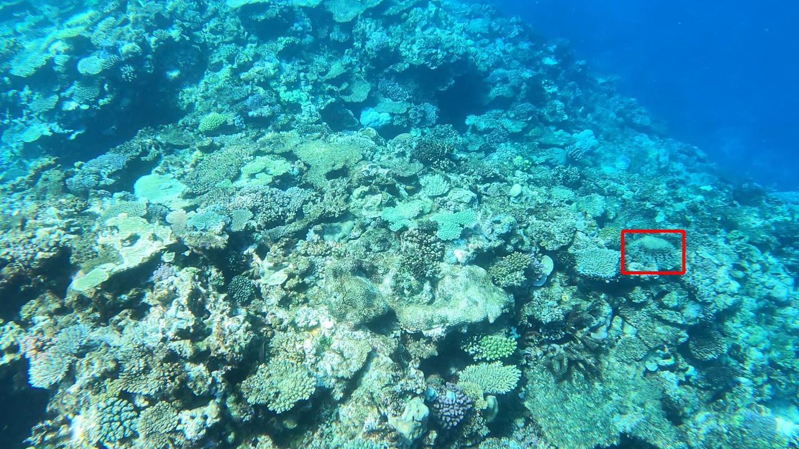

---
output:
  pdf_document: default
---
# Crown-of-Thorns Starfish Detection: Progress Report

## 1. Introduction

The Great Barrier Reef is home to a diverse marine ecosystem, but in recent years, the overpopulation of crown-of-thorns starfish (COTS) has emerged as a significant threat to coral health. These starfish consume hard coral at high rates, leading to widespread reef degradation. Traditional methods of detecting COTS, such as the "Manta Tow" technique, are time-consuming and prone to human error. This project aims to develop a machine learning pipeline to improve the detection of COTS from underwater image data.

The detection system is designed as an ensemble model, that leverages a Convolutional Neural Network (CNN) and YOLO (You Only Look Once) model. This progress report will describe the dataset, outline the data processing steps, present the proposed model architectures and some preliminary results, and conclude with next steps.

## 2. Data Description

The dataset consists of images extracted from three underwater videos recorded at different locations in the Great Barrier Reef. Each image has dimension 720 px by 1280 px. The dataset also includes a CSV file containing metadata for each image, such as video ID, sequence number, image index, and bounding box annotations.

{width="3in"}

### 2.1 Image Distribution

Each video has been decomposed into multiple sequences, with each sequence representing an uninterrupted period of footage (i.e., no surface breaks). Each sequence is further decomposed into a series of frames (i.e., jpg images), with a total of approximately 23,000 images. The number of sequences, images and images with COTS present is summarized in Table 1.

| Video ID | No. of Sequences | No. of Images | No. of Images with COTS | Pct. of Images with COTS |
| -------- | ---------------- | ------------- | ----------------------- | ------------------------ |
| 0        | 8                | 6708          | 2143                    | 31.9%                    |
| 1        | 8                | 8232          | 2099                    | 25.5%                    |
| 2        | 4                | 8561          | 677                     | 7.9%                     |
Table 1: Image Count Per Video

### 2.2 Bounding Box Distribution

Bounding box annotations indicate the presence and location of COTS in the images. Each sequence likely corresponds to the same location of the reef (i.e., same cluster of COTS) being filmed thus bounding boxes will typically have similar sizes within videos and sequences. Table 2 summarizes the distribution of bounding box sizes across videos.

| Video ID | Min Size (px) | Max Size (px) | Mean Size (px) |
| -------- | ------------- | ------------- | -------------- |
| 0        | 304           | 17766         | 2420.4         |
| 1        | 288           | 52170         | 2236.1         |
| 2        | 357           | 8084          | 2119.9         |
Table 2: Bounding Box Size Summary

## 3. Methods

### 3.1 Data Processing

Prior to training the model, the data has been processed to ensure compatability with package requirements and to improve model peformance. The pipeline consists of the following steps:

1. **Formatting Annotations**: Annotations from the CSV file are converted to individual text files as required by the selected algorithm.
2. **Image Processing**: Images are resized and normalized with respect to their mean and standard deviation. (TO-DO: tuning parameters such as brightness and hue, add specific details)
3. **Train-Test-Split**: Images are divided into traing and test sets while maintaing class distributions. Note that this step does not stratify by video before sampling (although this may be a method to consider) and instead randomly designates 20% of the entire dataset as test. (TO-DO: validation set)

### 3.1 Model Architecture

The main approach will be an ensemble model that "stacks" two computer vision algorithms. The first layer is a Convolutional Neural Network (CNN) that will perform binary classification on the images to predict the presence of at least one COTS. The positive predictions outputted from this classifier will then be sent to the YOLO (You Only Live Once) model which will perform object detection to identify the location of the COTS.

The rationale for this architechture is experimental curiosity and will be compared against a one-layer YOLO model. In a sense, first classifying an image as having COTS present is analagous to a prior belief which may help the object detection algorithm decided "where" instead of "if and where".

1. **Binary Classifier/CNN**

    This leverages the pre-trained `ResNet-18` model which utilizes weights learned from training on the `ImageNet` dataset. This allows for faster convergence during the training process when the network further tunes the weights based on the underwater images. This model outputs prediction for two classes: No COTS vs COTS. The loss function has been set to Cross Entropy. Table 3 presents tuned hyperparameters:

    | Hyperparameter | Value |
    | -------------- | ----- |
    | Epochs         | 10    |
    | Batch Size     | 16    |
    | Learning Rate  | 0.001 |
    Table 3: CNN Hyperparameters

    Based on these parameters, each epoch required approximately 18 min for a total of 3 hours training time (on a local machine).

2. **Object Detection/YOLO**

    YOLO v8 is used to locate COTS across the underwater images. This is the latest version of the algorithm and is optimized for real-time applications (which is the goal for COTS detection). Although this is a pre-trained model, it can be further tuned depending on the domain (i.e., underwater image data). It is has built-in functionality for automated hyperparameter search that will iteratively select the best hyperparameters (e.g., learning rate) based on the training data. This search is done over 50 epochs and the parameters are ypdated every 100 mini-batch updates within an epoch.

### 3.3 Model Training, Inference and Evaluation

The training pipeline is as follows:

1. The CNN model will first be trained using the train set. Images predicted to have:
    a. No COTS will be discarded.
    b. COTS will be fed to the YOLO model.
2. The YOLO model will be tuned using the subset of the train set predicted to have COTS present.

The inference pipeline is as follows:

1. The CNN model will first run inference on the test set. Image predicted to have:
    a. No COTS will be labelled as "0 detections".
    b. COTS will be fed to the YOLO model.
2. The YOLO model will run inference on the subset of the test set predicted to have COTS present. Images with:
    a. No COTS detected will be labelled as "0 detections".
    b. COTS will have the detected bounding boxes written to a text file.

With respect to model evaluation, three key configurations will be evaluated:

1. Binary Classifier/CNN: first layer of ensemble model.
2. Ensemble Model/(CNN + YOLO): first and second layer evaluated as one.
2. Object Detection/YOLO: trained and evalued independently of CNN.

Accuracy of classification will be used to evaluate the first configuration, and mean Average Precision (mAP) of the bounding boxes will be used to evaluate the latter two configurations.

## 4. Results

At this stage, model training is ongoing, and some preliminary results are outlined in Table 4.

| Model       | Accuracy | Precision | Recall | F1-Score | mAP  |
| ----------- | -------- | --------- | ------ | -------- | ---- |
| CNN         | 0.833    | 0.616     | 0.554  | 0.583    | N/A  |
| CNN + YOLO  | N/A      | N/A       | N/A    | N/A      | XXXX |
| YOLO        | N/A      | N/A       | N/A    | N/A      | XXXX |
Table 4: Placeholder for Model Results

## 5. Conclusion

This progress report outlines the current status of the Crown-of-Thorns Starfish detection project. The next steps are:

  1. Image Processing + Hyperparameter Tuning: are there any image transformations that improve CNN/YOLO performance?
  2. (Cross) Validation: this will be beneficial when tuning both the pre-trained CNN/YOLO models.
  3. Feedback Loop between CNN and YOLO: currently the models are trained separately and then stacked. Is there a way to train them together?
  4. Performance Metrics: it is not possible to make YOLO predictions with the current directory structure. It will need to be reconfigured to make predictions and correctly specified in the YAML file required for YOLO.